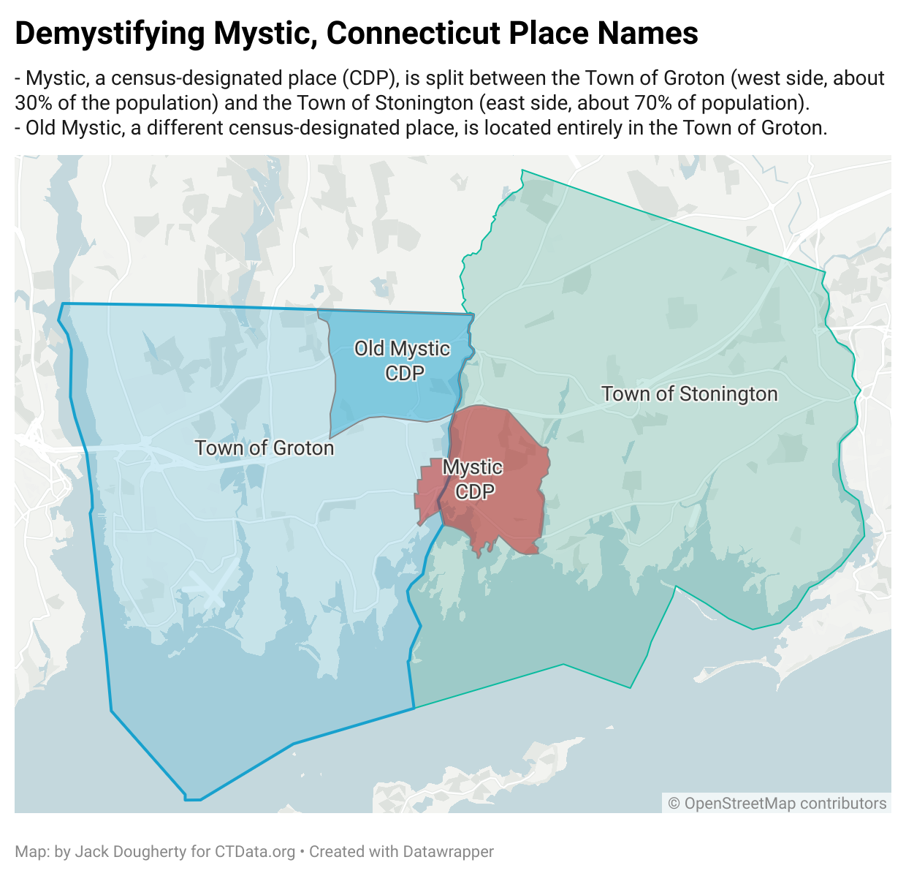

# CTData Collaborative's Connecticut Name Cleaner

Inspired by the [work of TrendCT](https://github.com/trendct/ctnamecleaner),
this repository contains a simple 2-column crosswalk of misspelled town names
and villages in Connecticut and their respective correct town names (there
are 169 of those in the state).

### `ctnamecleaner.head(5)`
```
name,realname
AMSTON,HEBRON
ANDOVER,ANDOVER
ANSONIA,ANSONIA
ASHFORD,ASHFORD
AVON,AVON
```

### Overlapping Places
Connecticut has 7 census-designated places (CDPs) with boundaries that overlap two or more towns, as shown in the table below from American Community Survey data 2019-2023. This tool assigns place names to the designated town when mentioned, or to the town with the largest share of the place's total population if not mentioned. Additional demographic variables are provided for more context. Example:

```
name,realname
MYSTIC GROTON,GROTON
MYSTIC STONINGTON,STONINGTON
MYSTIC,STONINGTON
OLD MYSTIC,GROTON
```

| Overlapping Places | Town | Pop 2019-23 | Share of Pop | Pct Renter-Occ | Pct White Alone |
|---|---|---|---|---|---|
| Mystic CDP (part) | Stonington | 3171 | 71% | 34% | 75% |
| Mystic CDP (part) | Groton | 1270 | 29% | 31% | 95% |
| Georgetown CDP (part) | Wilton | 1344 | 77% | 11% | 80% |
| Georgetown CDP (part) | Redding | 216 | 12% | 28% | 100% |
| Georgetown CDP (part) | Weston | 191 | 11% | 0% | 100% |
| Wauregan CDP (part) | Plainfield | 888 | 73% | 36% | 63% |
| Wauregan CDP (part) | Brooklyn | 321 | 27% | 12% | 81% |
| Plattsville CDP (part) | Easton | 524 | 71% | 0% | 73% |
| Plattsville CDP (part) | Fairfield | 218 | 29% | 4% | 83% |
| Candlewood Lake Club CDP (part) | New Milford | 134 | 57% | 0% | 73% |
| Candlewood Lake Club CDP (part) | Brookfield | 101 | 43% | 0% | 100% |
| Sail Harbor CDP (part) | New Fairfield | 124 | 91% | 0% | 70% |
| Sail Harbor CDP (part) | Sherman | 12 | 9% | 0% | 100% |
| Cornwall Bridge CDP (part) | Cornwall | 239 | 100% | 45% | 87% |
| Cornwall Bridge CDP (part) | Sharon | 0 | 0% | 0% | 0% |
| Mashantucket CDP (part) | Ledyard | 93 | 100% | 0% | 23% |
| Mashantucket CDP (part) | Preston | 0 | 0% | 0% | 0% |

### Demystifying Mystic Connecticut Place Names
- Mystic, a census-designated place (CDP), is split between the Town of Groton (west side, about 30% of the population) and the Town of Stonington (east side, about 70% of population).
- Old Mystic, a different census-designated place, is located entirely in the Town of Groton.
- [Datawrapper map link](https://www.datawrapper.de/_/YyuoF/?v=3)



### Updates & Contributions
We at CTData keep updating this crosswalk as we process more datasets.
Any contributions are welcome.

To make sure we don't have duplicates and map to one of 169 towns only, and to order entries alphabetically, you can run `misc/QA.ipynb`.

### License
MIT
